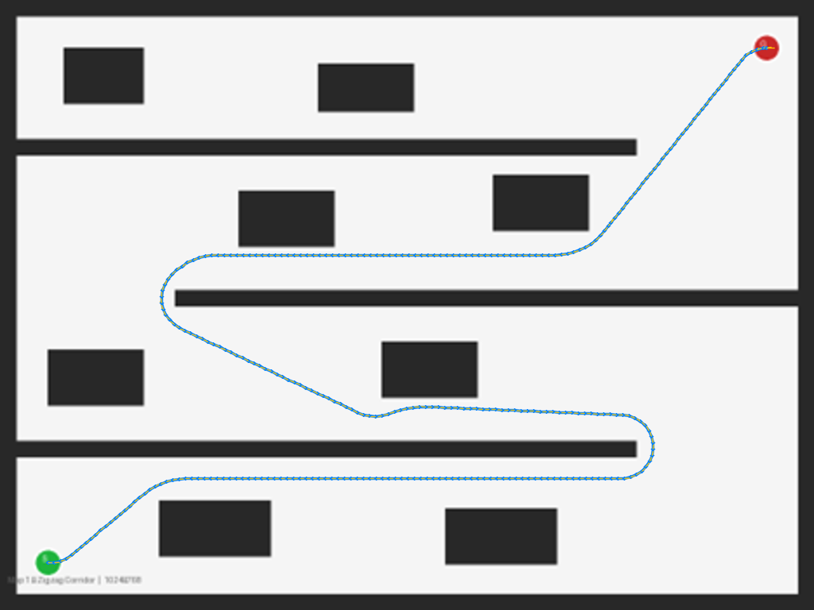
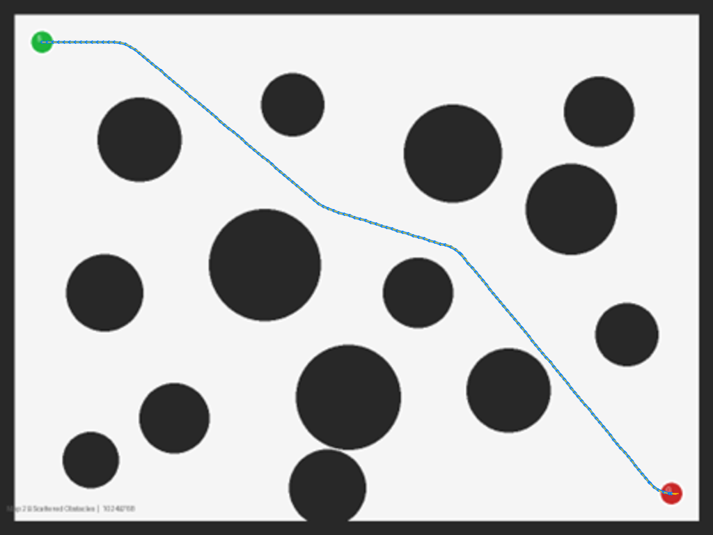
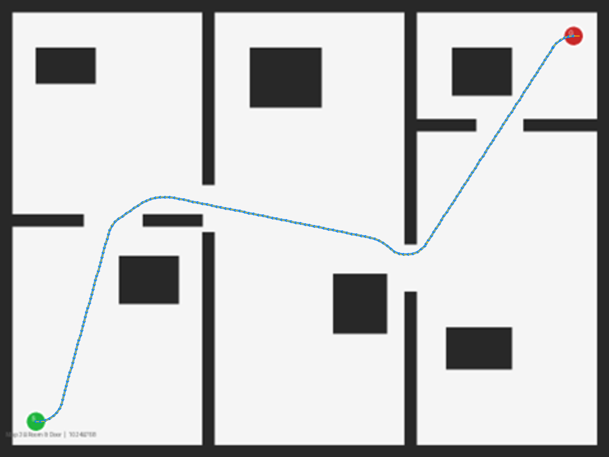

# PathSearch — Hybrid A* 경로 탐색

**맵 이미지 한 장을 넣으면, 로봇이 실제로 움직일 수 있는 경로를 자동으로 찾아주는 프로그램입니다.**

일반적인 경로 탐색(A*)은 로봇이 어느 방향으로든 자유롭게 꺾을 수 있다고 가정하지만, 실제 로봇(자동차, AGV 등)은 급격히 방향을 바꿀 수 없고 최소 회전 반경과 전/후진 제약이 있습니다.
이 프로그램은 그런 실제 제약을 반영하는 **하이브리드 A\*(Hybrid A\*)** 알고리즘으로 경로를 계산하고, 웹 브라우저에서 로봇이 그 경로를 따라 움직이는 모습을 애니메이션으로 가시화합니다.

- **입력**: 1024×768 크기의 맵 이미지 (초록 점 = 출발지, 빨강 점 = 도착지, 검정 = 벽/장애물, 밝은 회색 = 이동 가능 영역)
- **출력**: 출발지에서 도착지까지의 경로 (웹 대시보드 애니메이션 + 다운로드 가능한 결과 이미지)

---

## 🚀 빠른 시작

> 실행 파일은 용량 문제로 저장소에서 제거했습니다. 대신 `dotnet run`으로 바로 실행할 수 있습니다 (`dotnet run` 실행 시 NuGet 패키지 복원도 자동으로 함께 진행됩니다).

**필수 환경**: .NET 8.0 SDK

1. `src/` 폴더에서 cmd(또는 터미널) 창을 엽니다.
2. 아래 명령을 실행합니다.

```bash
dotnet run
```

콘솔 창에 아래와 같은 로그가 출력되고, 웹 서버가 자동으로 함께 실행됩니다.

```
[경로 설정 로드 완료] MapDirectory=...
[파라미터 로드 완료] TurningRadius=...px, StepSize=...px
[WebServer 시작] http://localhost:8888
[ctrl+c] to exit
```

브라우저에서 **http://localhost:8888** 을 열면 바로 사용할 수 있습니다. (콘솔 창을 닫거나 `Ctrl+C`를 누르면 서버가 종료됩니다.)

---

## 목차

1. [사용 방법 (웹 화면)](#1-사용-방법-웹-화면)
2. [탐색 결과 예시](#2-탐색-결과-예시)
3. [프로젝트 구조](#3-프로젝트-구조)
4. [개발 환경 설정](#4-개발-환경-설정)

---

## 1. 사용 방법 (웹 화면)

1. 브라우저(**Chrome 권장**)에서 **http://localhost:8888** 접속
2. 상단 바의 **맵 선택** 드롭다운에서 탐색할 맵 선택 (`maps/` 폴더에 있는 PNG 목록이 자동으로 표시)
3. **"경로 탐색"** 버튼을 누르면 Hybrid A* 탐색이 실행되고, 완료되면 캔버스 위에서 로봇이 경로를 따라 움직이는 애니메이션 재생
   - **"탐색 중지"**: 탐색·애니메이션 중지
   - **속도 슬라이더**: 애니메이션 재생 속도 조절 (1~60)
   - **다운로드 아이콘**: 탐색에 성공하면 경로가 그려진 결과 이미지(`result_{맵파일명}.png`)를 다운로드
4. 우측 상단 **⚙️ 톱니바퀴 아이콘**을 누르면 파라미터 패널이 열리며 로봇 차체 크기·회전 반경·조향각이나 탐색 알고리즘 세부 값을 실시간으로 바꿔볼 수 있고, 수정한 값은 바로 다음 탐색부터 적용되며 `data/parameter.json`에 자동 저장 및 반영됨

---

## 2. 탐색 결과 예시

`maps/` 폴더에 들어있는 3개 예제 맵에 대한 실제 탐색 결과입니다. (🟢 초록 = 출발, 🔴 빨강 = 도착, 🔵 파란 선 = 전진 구간, 🔴 빨간 선 = 후진 구간)

### map1_corridor


### map2_scattered


### map3_rooms


---

## 3. 프로젝트 구조

### 3-1. BE (`src/`)

| 폴더 | 역할 |
|---|---|
| `App/` | `AppConfig`(설정 로드) + `PlanningPipeline`(맵 1개: 로드→파싱→탐색→렌더→저장) |
| `WebServer/` | 웹 서버 구동(`WebServer.cs`) + REST API(`ApiController.cs`) |
| `IO/` | 맵 PNG 로드/파싱, 결과 이미지 저장 |
| `Map/` | 점유 격자(OccupancyGrid), 장애물 팽창(ObstacleInflator) |
| `Parameter/` | 로봇/탐색 파라미터 로드·저장 (`data/parameter.json`) |
| `Planning/` | **Hybrid A* 알고리즘 본체** — 운동학, 충돌검사, 휴리스틱, 탐색 루프 |
| `Visualization/` | 탐색 경로를 원본 이미지 위에 그리는 렌더링 |
| `Common/` | 웹 서버를 예외 발생 시 자동 재기동하는 백그라운드 Task 기반 클래스 |

**REST API** (`WebServer/ApiController.cs`)

| Method | Path | 설명 |
|---|---|---|
| GET | `/api/maps` | `maps/` 폴더 내 맵 목록 조회 |
| GET | `/api/maps/{fileName}` | 맵 원본 이미지 서빙 |
| POST | `/api/plan/{fileName}` | 해당 맵에 대해 Hybrid A* 탐색 실행 |
| GET | `/api/results/{fileName}` | 탐색 결과 오버레이 이미지 서빙 |
| GET / PUT | `/api/config` | 로봇/탐색 파라미터 조회 및 실시간 수정(`data/parameter.json`에 영속화) |

### 3-2. FE (`src_front/`)

Vite 기반 Vue 3 SPA이며, 빌드 결과물은 `src/wwwroot/`에 출력되어 BE가 정적 파일로 그대로 서빙합니다.

```
src_front/src/
├── pages/DashboardPage.vue        # 전체 레이아웃(상단 바 + 캔버스 + 파라미터 드로어)
├── components/
│   ├── MapSelectPanel.vue         # 맵 선택 드롭다운
│   ├── ControlPanel.vue           # 경로 탐색/중지, 재생 속도, 결과 다운로드
│   ├── ParameterPanel.vue         # 로봇/탐색 파라미터 실시간 조정 패널
│   ├── MapCanvas.vue              # 맵 렌더링 + 탐색 경로 애니메이션
│   └── LoadingModal.vue / ToastContainer.vue
├── stores/ (Pinia)                # mapStore, planStore, configStore, toastStore
├── services/                      # apiClient, mapService, planService, configService (axios)
└── models/                        # PathNode, Pose, PlanResult, PlanStatus, PlannerConfig
```

개발 중에는 `vite.config.ts`의 프록시 설정(`/api` → `http://localhost:8888`)으로 BE와 분리 실행할 수 있고, 배포 시에는 `npm run build`로 `src/wwwroot/`에 정적 파일을 생성해 BE 실행 파일에 포함시킵니다.

---

## 4. 개발 환경 설정

> 이 섹션은 **소스 코드를 직접 수정하거나 빌드**하려는 개발자를 위한 안내입니다. 그냥 실행만 하고 싶다면 맨 위 [빠른 시작](#-빠른-시작)을 참고하세요.

### 4-1. BE (C# .NET 8.0)

**필수 환경**: .NET 8.0 SDK

```bash
cd src
dotnet run       # 개발 모드 실행 (http://localhost:8888). NuGet 패키지 복원도 자동으로 함께 진행됨
dotnet build     # 빌드만 확인하고 싶을 때
```

배포용 단일 실행 파일 생성:

```bash
# Windows
dotnet publish -c Release -r win-x64 --self-contained -p:PublishSingleFile=true

# Linux
dotnet publish -c Release -r linux-x64 --self-contained -p:PublishSingleFile=true
```

### 4-2. FE (Vue 3 + TypeScript)

**필수 환경**: Node.js 18 이상 / npm

```bash
cd src_front
npm install    # vue, vuetify, pinia, axios 등 패키지 설치
npm run dev    # 개발 서버 (BE가 8888에서 실행 중이어야 /api 프록시 동작)
npm run build  # 프로덕션 빌드 → src/wwwroot/ 에 출력
```
